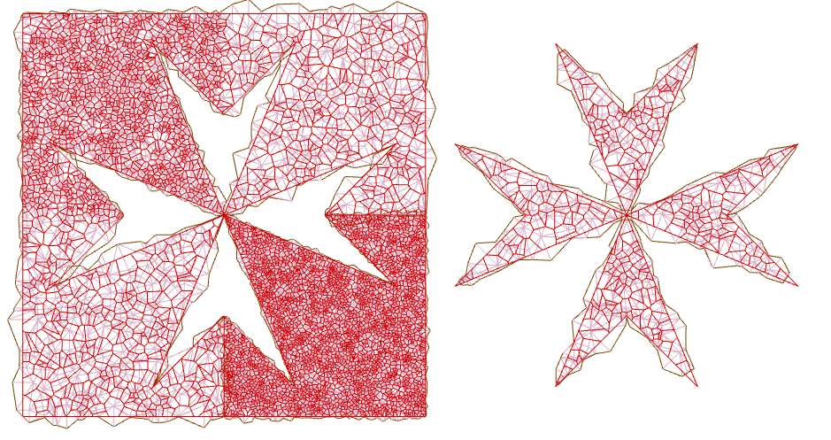

# VoroBox

## Quick Summary

*VoroBox* produces *Conforming Voronoi Diagrams* in 2D. These diagrams fill either a polygon or the convex hull of a set of points specified in an *YAML* or *JSON* formatted input file. It outputs two or more *VTK* files suitable for drawing the resulting diagram and (optionally) *YAML* files in the same format as the input which can be used to iterate the diagram. The Voronoi cells produced are not clipped, they are accurate representations of the nearest neighbour domains produced from the initial data. *VoroBox* is written in *Swift*, and is in a Swift Package Manager format which can be run on any system with swift installed. 

## Install

Prerequisites are Swift - you can run *VoroBox* using the swift package manager on either an Apple machine or Linux. I haven't tried to use it under Windows. The example input files are in YAML; but *VoroBox* expects a JSON file so you'll need a convertor. I use a simple ruby script. For convenience *VoroBox* use the [Files](https://github.com/JohnSundell/Files) package. To see the output plots you'll need a plotting package that can read VTK files; [pyvista](https://www.pyvista.org/) is one such.

## Input and Output is Text Data

Once you have a YAML input file prepared you need to generate a file *Zones/zoneData.json* which *VoroBox* will read.
To create complex geometries you can combine several *zones* where each zone is a "weakly simple polygon" with no internal holes; by combining them arbitrarily complex shapes can be triangulated. The *Zones* folder has some examples.
By default each zone is listed in an anticlockwise direction; if you need to you can specify *order: clockwise* to reverse this. By default *VoroBox* produces a Voronoi diagram; here some of the constituent zones have been allowed to blend into each other, whilst one zone is left distinct.

To achieve this the underlying triangulation is adjusted to make the input points become part of the Voronoi diagram, as
a consequence the triangulation can become distorted and overlapping. The red lines show the Voronoi cells, the grey lines the underlying Delaunay triangulation

but if *conformingTo: Delaunay* is set a Delaunay triangulation is produced instead.

<!--
A quick outline of the process is as follows;
?? list ??
- Write a Yaml file describing the geometry as a set of Weakly Simple Polygons; they should be ordered in an anticlockwise direction, but the directive *order:clockwise* can override that
- Generate a JSON file from the YAML file
- 1 - Parse the input JSON file and note all the points to be added in the *Triangulation.coords* array,
- 2 - Obtain a set of polygons with associated properties. Index *z* of each zone points the vertex *v = zoneIndices[z]* which in turn describes the point _[Triangulation.coords[2 * v], Triangulation.coords[2 * v + 1]]_
- 3 - Break each of these weakly simple polygons into a (usually larger) set of convex zones
- 4 - Apply the Circle-Sweep algorithm to generate the Delaunay Triangulation and the convex hull for each convex zone.
- 5 - Join all the convex zones, noting whether these should be blended or distinct to produce an overall Delaunay triangulation. For conformingTo: Delaunay VoroBox is finished - go to step 12.

- 6 - If conformingTo: Voronoi start modifying the triangulation so that the resulting Voronoi diagram includes the specified perimeter points - instead of them being included by the triangulation. First locate a generator point for each corner angle of the input zones. This is located at the mid-point between the corner and the centre of the smallest triangle incircle found at each corner. (picture)
- 7 -  Use the generator point to specify three constructor points per corner; one is the generator and two are reflections of the generator in the sides of the polygon. Altogther there are four possible constructor points, two inside and two outside each corner. For reflex corners the two external points are equal, for convex corners the two internal points are equal. As corners become more and more collinear the points all converge the the corner itself, so that on a collinear point only one point remains.
- 8 - Add the new constructor points.
- 9 - Remove the original corner vertices from the triangulation, including ones now collinear.
- 10 - Ensure the triangulation is still a Delaunay triangulation (albeit one that is now possible overlapping in places)
- 11 - Add image points along all the edges of the active zones which force all circumcentres to lie on the edges. -->

## End Result

Some more images of coastlines; first

and here is the coast of South Australia shown as edges

## Note

I couldn't find a good example of conforming Voronoi diagrams in the public domain so I wrote this as a way to learn *Swift*. The triangulation code is a port of the [Delaunator](https://github.com/mapbox/delaunator) javascript library of [mapbox](https://github.com/mapbox) to the Swift programming language, although several modification have been made. *VoroBox* still uses a flat array data structure of halfEdges and vertices to organize the meshes.
